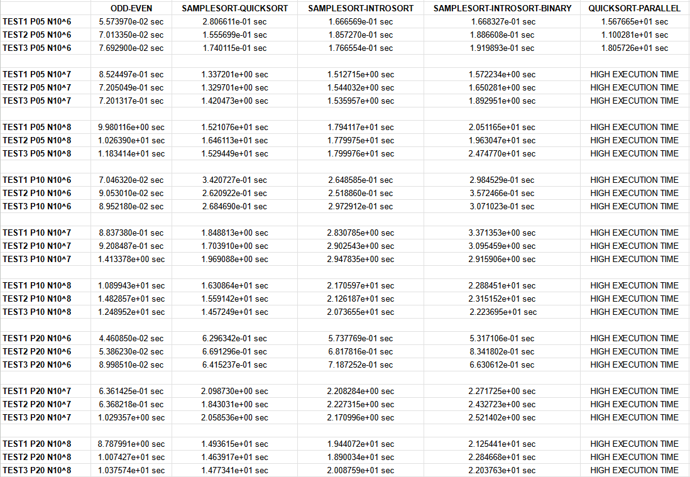

# PARALLEL ALGORITHMS

### **OVERVIEW**

Parallel algorithms implemented in C using MPI for parallelization. Tests conducted with random inputs and for different numbers of processors and input sizes.

### **PARALLEL ODD-EVEN**

`Usage: mpiexec -n 
 odd-even <n>`

The parallel odd-even sort algorithm sorts a randomly generated sequence of size n, as specified in the command line arguments. It alternates between even and odd phases during the sorting process, with processes exchanging elements with their even or odd neighbors depending on the current phase. During these element exchanges, processes merge their local elements with those received from their neighbors to ensure gradual sorting. The code measures the time required to sort the list using the MPI_Wtime() function and prints this timing. It includes other necessary functions for the proper functioning of the odd-even sort, such as comparison and merge functions specific to each phase.

### **SAMPLESORT**

`(1) "samplesort-introsort" Usage: mpiexec -n 
 samplesort-introsort <n>`

`(2) "samplesort-introsort-binary" Usage: mpiexec -n 
 samplesort-introsort-binary <n>`

The original version of samplesort, which uses quicksort as the internal sorting method, has been modified to support two significant variations:

(1) Samplesort with introsort instead of quicksort.

(2) Samplesort with introsort as in (1), but with binary search to locate elements between global separators.

The code includes functions like Swap, BinarySearch, Partition, InsertionSort, HeapSort, among others, necessary to perform samplesort properly according to the modifications. Both versions of the code display the time taken for sorting on the console. The code uses the MPI library for communication between parallel processes, with each process representing a task that operates on a portion of the list. It begins with the sampling phase, where processes select samples from the local list. The samples are chosen equidistantly to represent the distribution of elements, facilitating the determination of splitters responsible for dividing the intervals. In (2), based on the splitters, the local list is partitioned into intervals belonging to different processes using binary search to determine each element's position in the sorted list. After these determinations, processes exchange elements according to the intervals and perform local sorting of the received elements using introsort.

### **PARALLEL QUICKSORT**

`Usage: mpiexec -n 
 quicksort-parallel <n>`

This parallel quicksort algorithm sorts a set of numbers using the quicksort algorithm in a parallel manner, distributing the work among MPI processes. The Partition function is used to select a pivot element and divide the list. After local sorting, processes exchange data among themselves based on element comparisons and send and receive data between MPI processes to obtain the globally sorted list. In the end, the total sorting time is displayed on the console.

### **MAKEFILE**

The source code includes a makefile with the necessary flags "-g -Wall" for compiling the sorting files.

### **SORTING ANALYSIS**

Tests were conducted for random inputs of sizes 10^6, 10^7, and 10^8. For each input size, different numbers of processors were tested. Three observations were recorded for the same test case since the inputs are random, and a single result may not always accurately represent the time for a specific condition.

It is observed that parallel odd-even sort, when compared to the other implemented parallel sorting methods, exhibits a significant advantage, especially as the input size increases up to 10^8. For all algorithms, execution time increases as the input size grows, indicating a consistent and expected behavior.

When comparing the different versions of samplesort, it is noted that with the internal quicksort, performance improves as the input size increases compared to introsort. When introsort is implemented with binary search, there is virtually no difference observed in relation to its version without this modification for the tested inputs. Significant improvements may be more noticeable with larger inputs.

In many test cases, as the number of processors increases for the same input size, instead of observing a reduction in sorting time, a small improvement or even an increase in execution time is common. Some factors contributing to this phenomenon may be communication overhead or concurrency conditions, where the benefits of parallelism are outweighed by the overhead.

The tests were conducted on the Windows Subsystem for Linux (WSL) on a Windows machine, and this influenced the execution time for all algorithms. For large inputs beyond 10^7, it became impractical to measure the time for the parallel quicksort algorithm due to sorting delays caused by the system.

### **AUTHORS**

- Giovane Hashinokuti Iwamoto - Computer Science student at UFMS - Brazil - MS
- Paulo Gustavo Hemmel Garcia - Computer Science student at UFMS - Brazil - MS

I am always open to receiving constructive criticism and suggestions for improvement in my developed code. I believe that feedback is an essential part of the learning and growth process, and I am eager to learn from others and make my code the best it can be. Whether it's a minor tweak or a major overhaul, I am willing to consider all suggestions and implement the changes that will benefit my code and its users.
